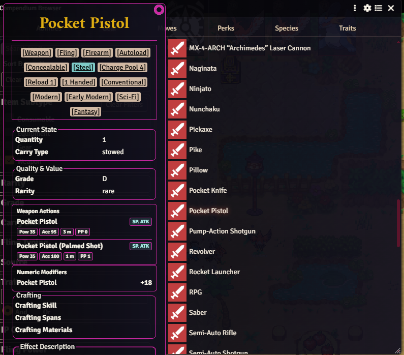

# PTR2e Gear Description Expansion

Foundry VTT module for Pokemon Tabletop Reunited: Evolved.

This module expands PTR2e weapon and worn gear previews in the Compendium Browser and item hover embeds.

## Installation

Paste this manifest URL into Foundry's **Install Module** dialog:

`https://raw.githubusercontent.com/Umbura/ptr2e-gear-description-expansion/main/module.json`

## Features

- Shows weapon action names in weapon gear previews.
- Shows the offensive stat used by each weapon action: `ATK`, `SP. ATK`, or `Status`.
- Shows action power, accuracy, range, and PP chips when available.
- Shows numeric item modifiers from enabled item effects.
- Shows numeric modifiers for worn gear such as armor.
- Reads common armor modifier keys such as attribute multipliers and defensive modifiers.
- Separates `ATK` and `SP. ATK` modifiers when both are present.
- Displays flat damage modifiers as `Damage` instead of incorrectly labeling them as attack stat bonuses.
- Injects the extra weapon preview blocks at runtime.
- Patches direct weapon embeds so the expanded details also appear outside the hover preview when possible.
- Fixes the Gear tab Carry Slot filter options and filtering behavior at runtime.
- Does not alter item data, compendium data, or PTR2e system files.

## Compatibility

- Foundry VTT: 14+
- System: Pokemon Tabletop Reunited: Evolved (PTR2e)

## Notes

- The module only registers hooks when the active system id is `ptr2e`.
- CSS classes and data flags use the `ptr2e-gear-description-expansion` prefix to avoid collisions with system styles.
